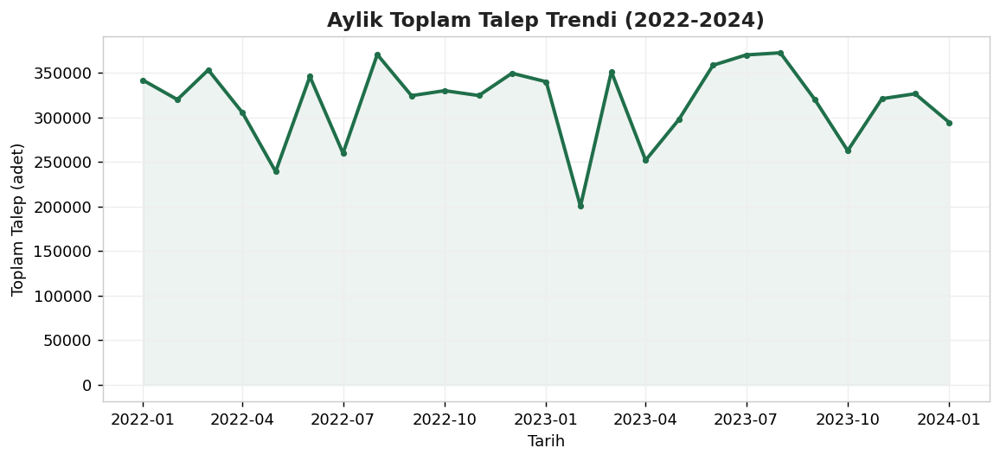
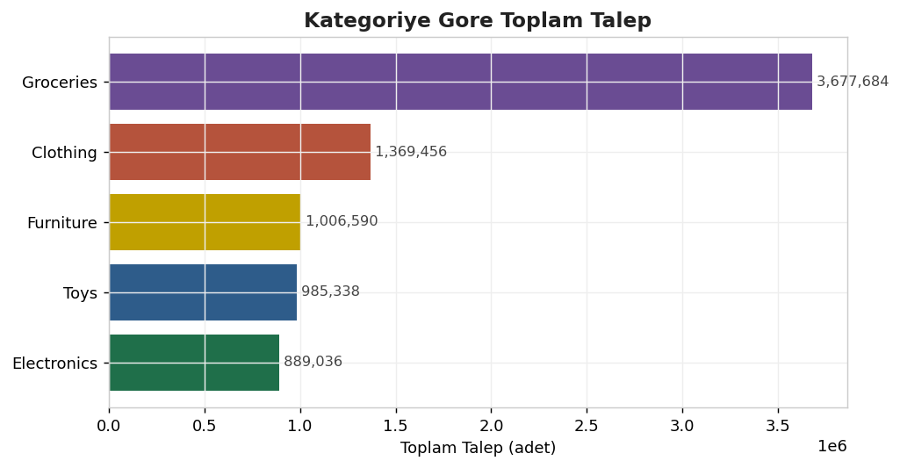
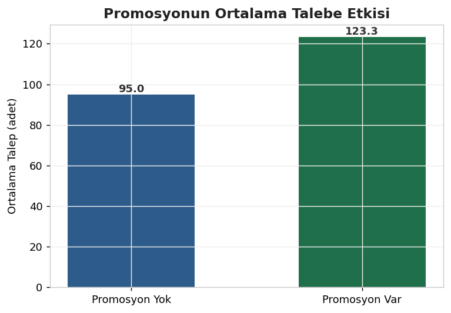
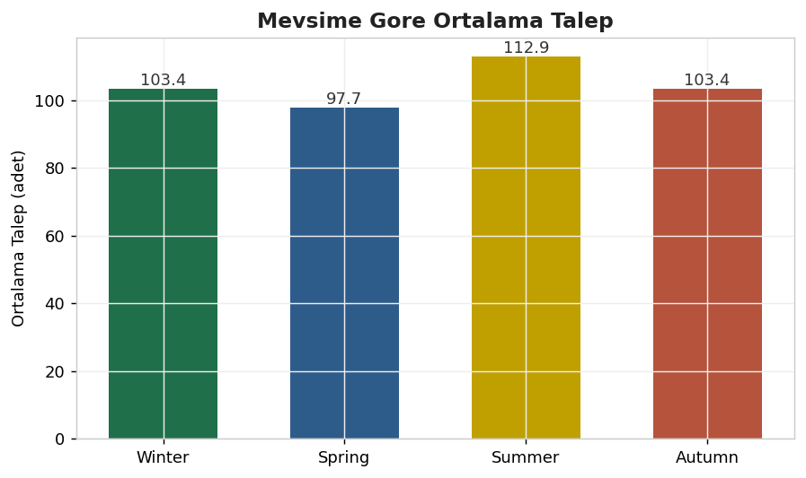
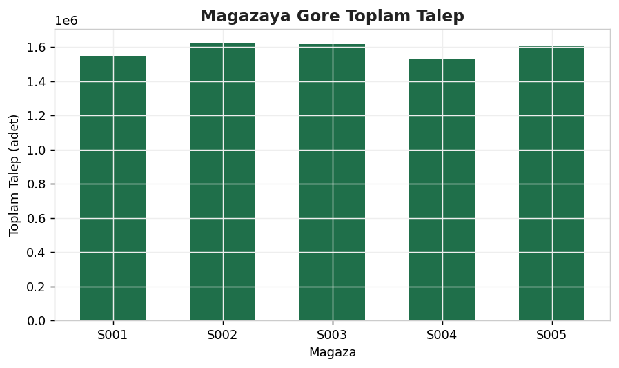
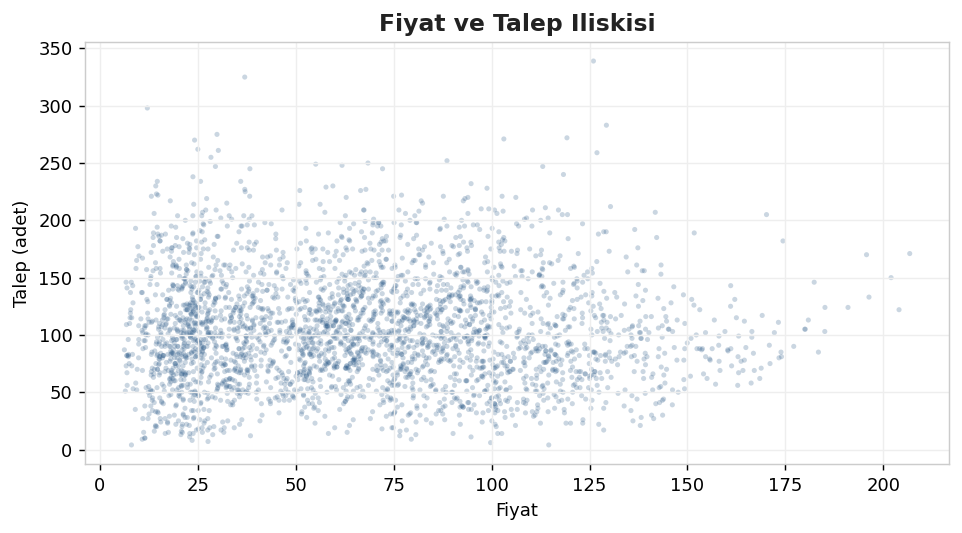

# DemandStockInsight

A local demand and stock analysis project using a retail inventory dataset. The goal is to explore sales behavior, promotions, demand patterns, and inventory relationships for a small set of stores and products.

> **Status:** ✅ Data is loaded and initial analysis is ready. The notebook and script support further exploration.

---

## 📌 Overview

This repository analyzes retail demand data from multiple stores and products. It is designed to help you:

- understand how price and promotions relate to demand
- explore demand patterns across stores and products
- build a foundation for forecasting or inventory optimization

---

## 📊 Visual Highlights

Check out the key demand patterns discovered in the analysis dashboard and chart gallery below.

- **Interactive dashboard:** `results/dashboard.html`
- **Key charts:** trend, category demand, promotion impact, seasonality, store comparison, price vs demand

### Chart gallery

| Monthly trend | Demand by category | Promotion impact |
| --- | --- | --- |
|  |  |  |
| Seasonality | Store demand | Price vs demand |
|  |  |  |

---

## 📦 Dataset

- **File:** `data/inventory_demand_forecasting_dataset.csv`
- **Rows:** 4,380
- **Columns:** 6
- **Fields:**
  - `date` — sale date
  - `store_id` — store identifier
  - `product_id` — product identifier
  - `price` — product price
  - `promotion` — promotion flag (0/1)
  - `demand` — units sold

---

## 🛠️ What is included

- `data/` — dataset file
- `notebooks/data_analysis_starter.ipynb` — starter notebook for exploration
- `analyze_data.py` — initial summary script
- `README.md` — project overview

---

## 🔍 What to explore next

1. Convert `date` to datetime and inspect seasonality.
2. Compare demand across stores and products.
3. Measure how promotions affect demand.
4. Build visualizations for price, demand, and promotion relationships.
5. Use the notebook to test forecasting or inventory optimization ideas.

---

## 🚀 How to use

1. Open `notebooks/data_analysis_starter.ipynb` in Jupyter or VS Code.
2. Update the dataset filename if needed.
3. Run the notebook cells to inspect the data and generate charts.
4. Or run `python analyze_data.py` to print the data summary.

---

## 💡 Notes

- This project is mostly local and data-driven.
- The dataset is ready for exploratory analysis and future forecasting work.
- Add charts, analysis findings, or model experiments to the notebook and `results/` folder.
